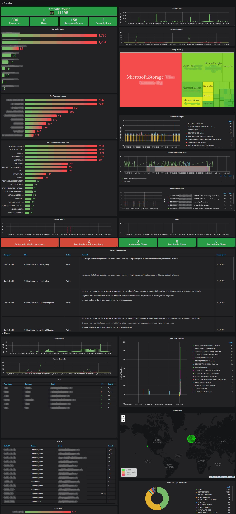

# Azure Activity Log Dashboard
Dashboard to visualize Azure Activity Logs data from [Logstash Event Hubs plugin](https://www.elastic.co/guide/en/logstash/current/plugins-inputs-azure_event_hubs.html)

Setup Azure Activity Log to stream data in an Azure EventHub so the ES plugin can pickup the data. Microsoft provide documentation: [Export Azure Activity log to storage or Azure Event Hubs](https://docs.microsoft.com/en-us/azure/azure-monitor/platform/activity-log-export)

Dashboard is setup to filter based on a subscription name by mapping the subscription GUID to a friendly name. The Logstash filter files have been provided.

