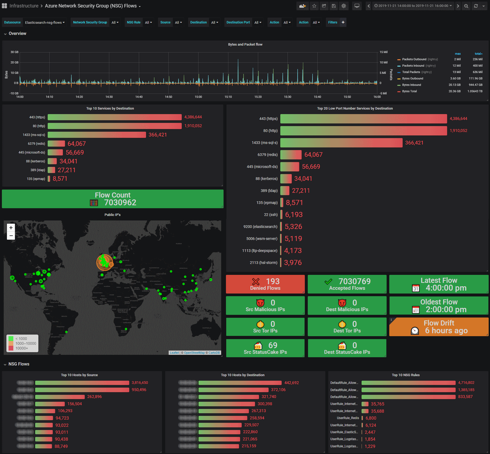

# Azure NSG Flow Log Dashboard
Dashboard to visualize Azure NSG Flow Logs data from [Logstash Event Hubs plugin](https://www.elastic.co/guide/en/logstash/current/plugins-inputs-azure_event_hubs.html)

Deploy Microsofts [Azure Network Watcher NSG Flow Logs Connector](https://github.com/microsoft/AzureNetworkWatcherNSGFlowLogsConnector) Function App to gather the data.

Setup Azure NSG FLow Logs to stream data in an Azure EventHub so the ES plugin can pickup the data.

The Logstash filter files have been provided.

To control the costs and increase throughput you will want to increase the batch sizes of how often the Logstash Event Hub data source saves the checkpoints to storage, and increase the number of `pipeline.workers` and `pipeline.batch.size` options.

