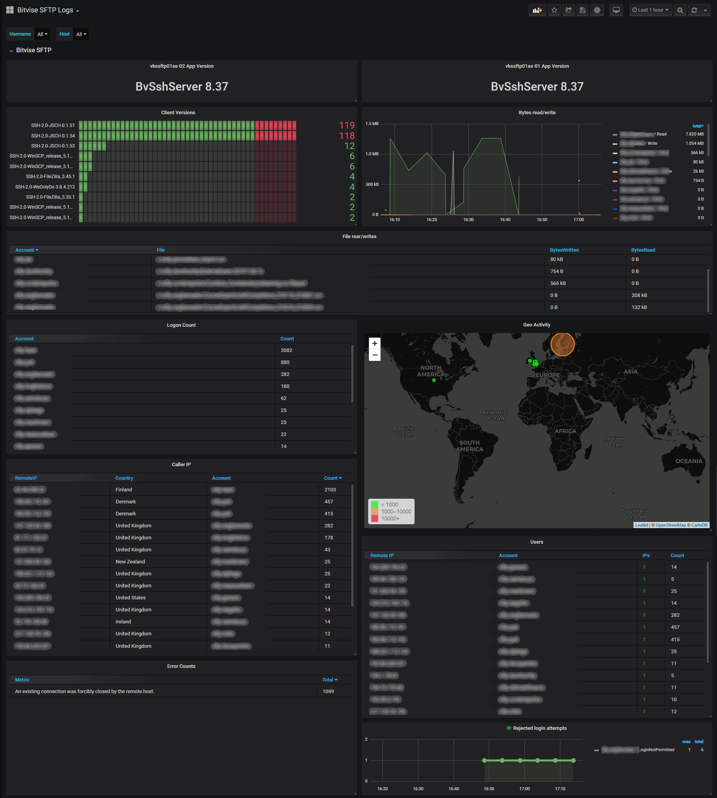

# Bitvise SFTP Log Dashboard
Dashboard to visualize Bitvise SFTP Log data from [Bitvise](https://www.bitvise.com/ssh-server)

Dashboard is setup to filter based on a host name or by virtual account. The Logstash filter files have been provided, along with Filebeat config.

# Gotchas
* Some panels formatting expect all accounts to begin with `sftp.` If a panel is all on the Y-axis, remove the formatting.
* All panels and variables are based on the VirtualUser. Nothing has been setup for the WindowsUser. If you use Windows accounts for logins you'll need to edit the panels.
