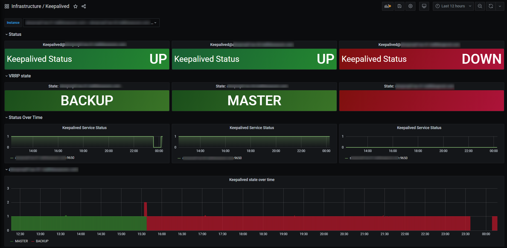
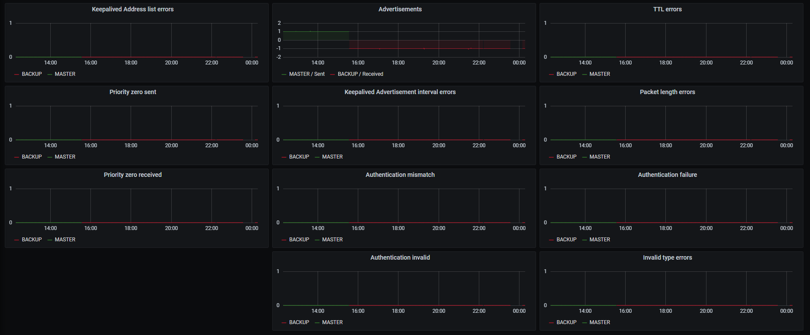

# Keepalived Dashboard
Dashboard to visualize [Keepalived Metrics](https://https://keepalived.org/) using [keepalived_exporter](https://github.com/gen2brain/keepalived_exporter).

## Dashboard
The Keepalived status (Up/Down) is set based on both keepalived_exporter showing the service as up, and node_exporter showing the service as running. You can adjust the values or remove one of the checks if you want to simplfy it.

