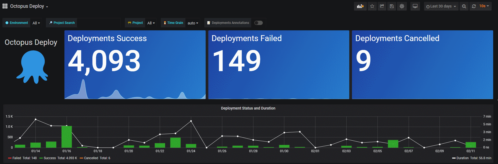

# Octopus Deploy Dashboard
Dashboard to visualize [Octopus Deploy](https://octopus.com/)

Setup a read-only user with access to the Octopus Deploy SQL Server database. If you are using the included SQL Server Express you'll have a few more hoops to jump through to enable access on port 1433 remotely from Grafana. To enable TCP/IP connections on SQL Express open the `SQL Server Configuration Manager`. Under `SQL Server Network Configuration` select `Protocols for SQLEXPRESS`. Right click `TCP/IP` and open `Properties`. Scroll down to `IPAll` and blank out `TCP Dynamic Ports` and set `TCP Port` to `1433`. You may need to set your local windows firewall to allow port 1433 through.

Dashboard is setup to filter the variables bosed on the Project search box. Type a full or partial search term to filter the board automatically, no need to then select individual projects.

The Deployment Annotations will display over the top of the time series line graph, and hovering over will give details on each deployment. These are also filtered based on the variables at the top of the page.

