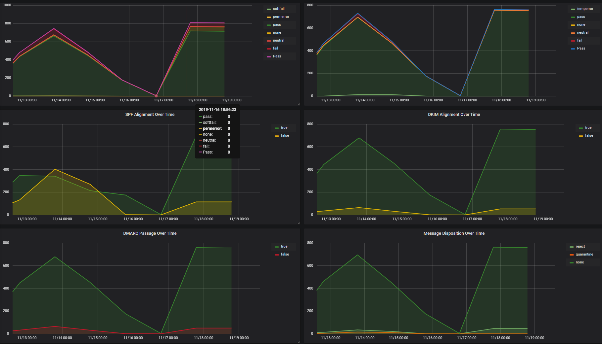
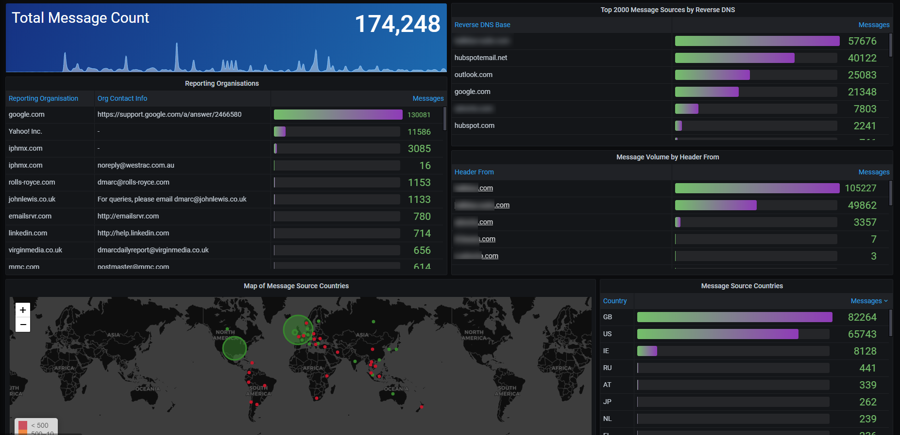

# DMARC Reports Dashboard
Dashboard to visualize data from [ParseDMARC](https://github.com/domainaware/parsedmarc)

Available from Grafana.com: [DMARC Reports](https://grafana.com/grafana/dashboards/11227)

Two data sources to be updates, one for Aggregate reports and one for Forensic reports.

Requires Worldmap and Piechart plugins for all panels to display.

Aggregate data is per-day, so dashboard is only helpful when looking back 24hr+.

