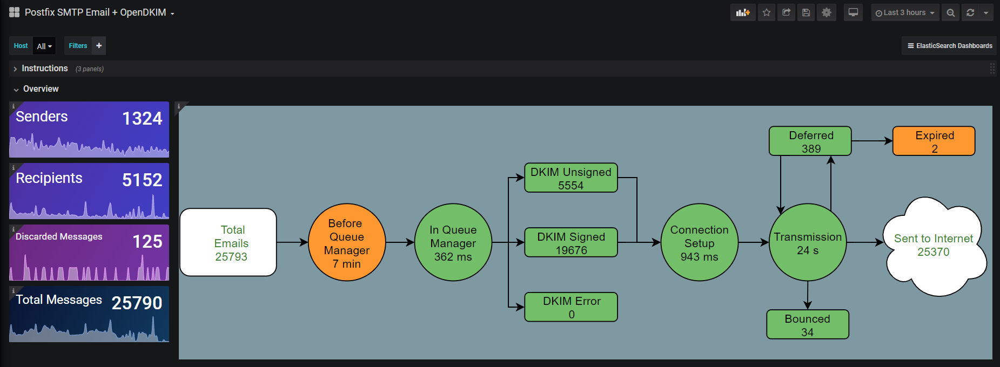
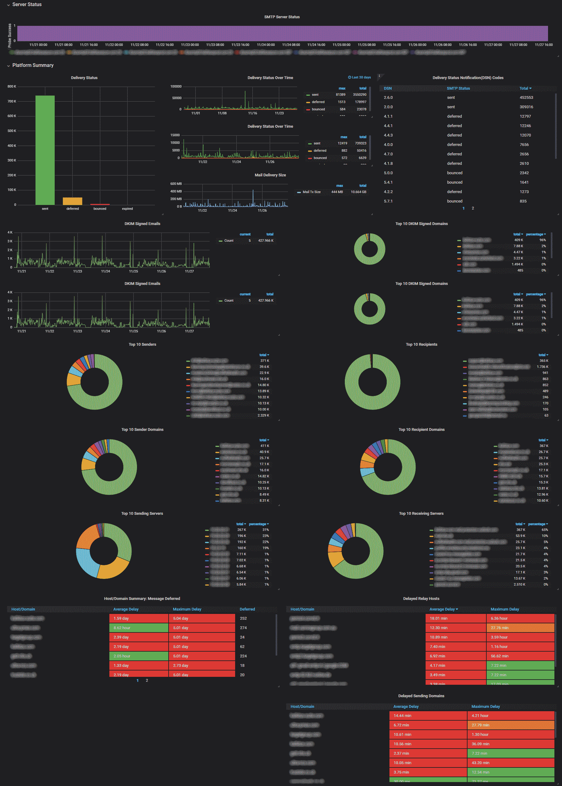

# Postfix SMTP Email + OpenDKIM Dashboard
Dashboard to visualize data from Postfix and OpenDKIM

# Features
* Supports Postfix log messages
* Supports OpenDKIM log messages
* Mail flow diagram of counts and average timings
* Postfix aggregate log report
* SASL Authentication errors
* Includes documention:
  * Email relay troubleshooting guide
  * Dashboard usage guide
  * ESMTP response code reference guide
  * Mail process flow guide

Available from Grafana.com: [Postfix SMTP Email + OpenDKIM](https://grafana.com/grafana/dashboards/11293)

# Logstash config
Filters and grok files are provided on [GitHub](https://github.com/bhozar/grafana-dashboards/tree/master/postfixsmtpemail_opendkim/logstash).

# Prometheus config
Required for the graph displaying results from the port 25/587 probes. Required [Prometheus blackbox_exporter](https://github.com/prometheus/blackbox_exporter).
```
  - job_name: 'smtp_status_tls'
    metrics_path: /probe
    params:
      module: [smtp_starttls]
    static_configs:
      - targets: [
		'your.mail.server.com'		
	        ]
    relabel_configs:
      # Ensure port is 25, pass as URL parameter
      - source_labels: [__address__]
        regex: (.*)(:.*)?
        replacement: ${1}:587
        target_label: __param_target
      # Make instance label the target
      - source_labels: [__param_target]
        target_label: instance
      # Actually talk to the blackbox exporter though
      - target_label: __address__
        replacement: 127.0.0.1:9115

  - job_name: 'smtp_status'
    metrics_path: /probe
    params:
      module: [smtp_banner]
    static_configs:
      - targets: [
                'your.mail.server.com'
                ]
    relabel_configs:
      # Ensure port is 25, pass as URL parameter
      - source_labels: [__address__]
        regex: (.*)(:.*)?
        replacement: ${1}:25
        target_label: __param_target
      # Make instance label the target
      - source_labels: [__param_target]
        target_label: instance
      # Actually talk to the blackbox exporter though
      - target_label: __address__
        replacement: 127.0.0.1:9115
``` 

# Blackbox_exporter blackbox.yml config
```
  smtp_starttls:
    prober: tcp
    timeout: 20s
    tcp:
      preferred_ip_protocol: ip4
      tls_config:
        insecure_skip_verify: true
      query_response:
        - expect: "^220 ([^ ]+) ESMTP (.+)$"
        - send: "EHLO prober"
        - expect: "^250-(.*)"
        - send: "STARTTLS"
        - expect: "^220"
        - starttls: true
        - send: "EHLO prober"
        - expect: "^250-"
        - send: "QUIT"
  smtp_banner:
    prober: tcp
    timeout: 20s
    tcp:
      preferred_ip_protocol: ip4
      query_response:
        - expect: "^220 ([^ ]+) ESMTP (.+)$"
        - send: "EHLO prober"
        - expect: "^250-(.*)"
        - send: "MAIL FROM:ping@your.mail.server.com"
        - expect: "^250-(.*)"
        - send: "RCPT TO:test.email@your.mail.domain.com"
        - expect: "^250-(.*)"
        - send: "QUIT"
```

# Screenshots




# Bugs and suggestions
Bug reports and suggestions to [GitHub](https://github.com/bhozar/grafana-dashboards/tree/master/postfixsmtpemail_opendkim) please!
